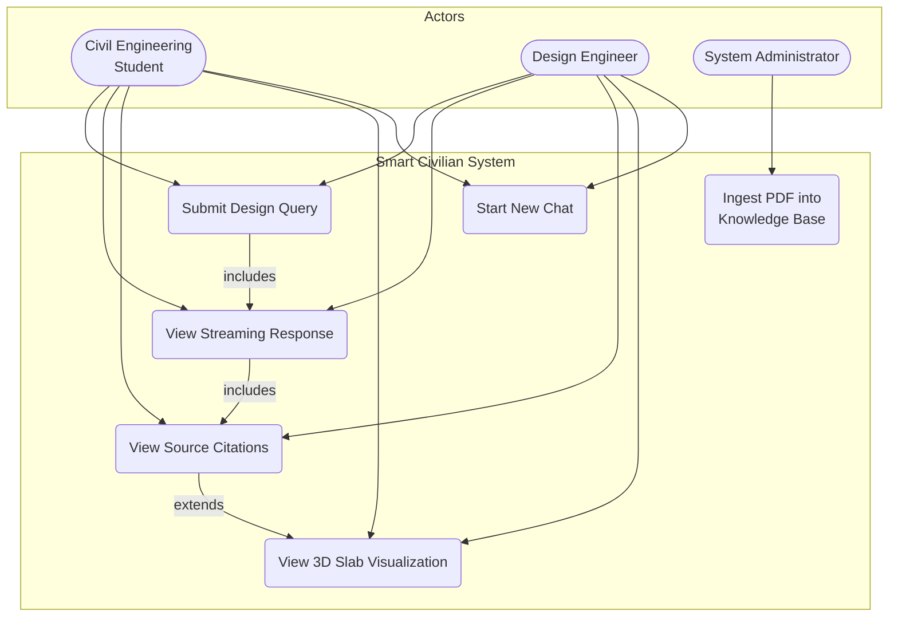
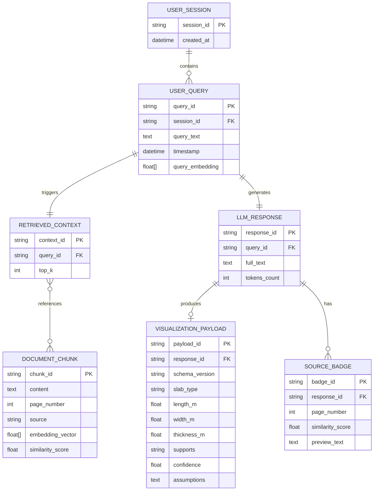
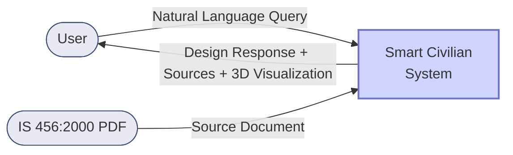
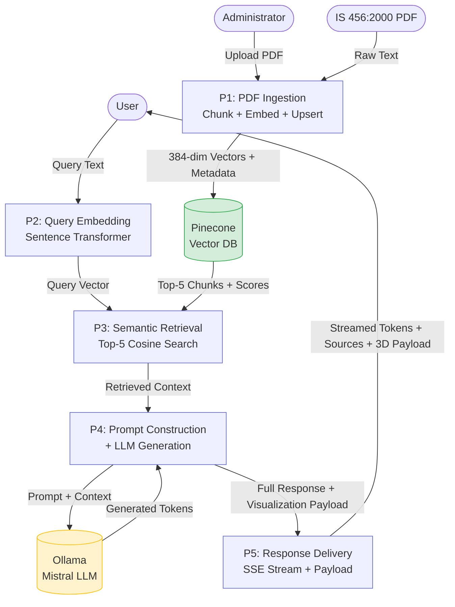
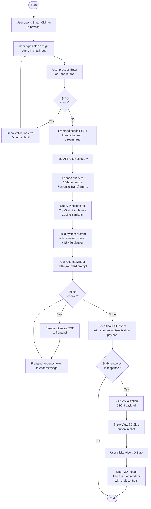
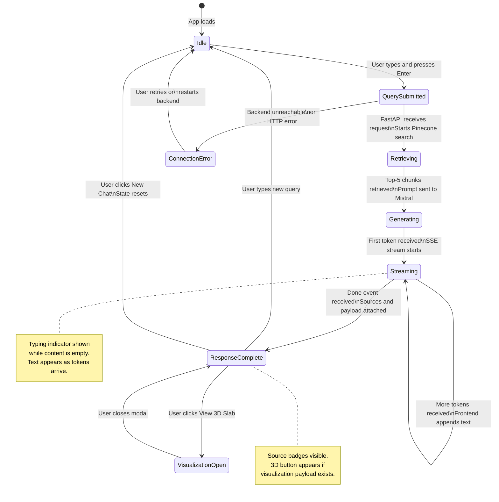
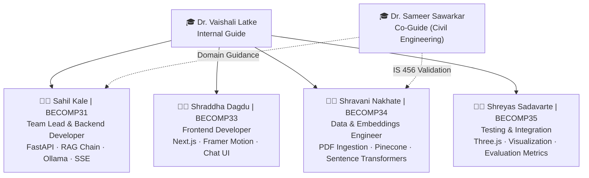

# SMART CIVILIAN — BE Stage II Report Content
# PCCOER, Department of Computer Engineering, A.Y. 2025–2026
# Paste each section into the corresponding part of the .docx template

---

## TITLE PAGE

**Project Title:**
Smart Civilian: An AI-Powered RAG-Based RCC Slab Design Assistant as per IS 456:2000

**Students:**
| Name | Exam No. |
|------|----------|
| Sahil Kale | BECOMP31 |
| Shraddha Dagdu | BECOMP33 |
| Shravani Nakhate | BECOMP34 |
| Shreyas Sadavarte | BECOMP35 |

**Internal Guide:** Dr. Vaishali Latke
**HOD:** Prof. Dr. Vijay Kotakr
**Project Coordinator:** Prof. Dr. Vaishali Latke
**Principal:** Prof. Dr. Harish U. Tiwari
**Department:** Computer Engineering
**College:** Pimpri Chinchwad College of Engineering And Research, Ravet
**A.Y.:** 2025–2026

---

## CERTIFICATE

This is to certify that the Project Entitled

**Smart Civilian: An AI-Powered RAG-Based RCC Slab Design Assistant as per IS 456:2000**

Submitted by

| Name | Exam No. |
|------|----------|
| Sahil Kale | BECOMP31 |
| Shraddha Dagdu | BECOMP33 |
| Shravani Nakhate | BECOMP34 |
| Shreyas Sadavarte | BECOMP35 |

is a bonafide work carried out by Students under the supervision of Dr. Vaishali Latke and it is submitted towards the partial fulfillment of the requirement of Bachelor of Engineering (Computer Engineering) Project.

---

## ACKNOWLEDGEMENTS

It gives us great pleasure in presenting the project report on **'Smart Civilian: An AI-Powered RAG-Based RCC Slab Design Assistant as per IS 456:2000'**.

We would like to take this opportunity to sincerely thank our internal guide **Dr. Vaishali Latke** for her unwavering guidance, technical mentorship, and continuous encouragement throughout the project. Her expertise in AI systems and deep understanding of RAG architectures provided the foundation upon which this project was built. We are also deeply grateful to **Dr. Sameer Sawarkar** from the Department of Civil Engineering, whose domain knowledge of IS 456:2000 and structural design principles was indispensable in bridging the gap between computer science and civil engineering.

We extend our heartfelt gratitude to our **Project Coordinator, Prof. Dr. Vaishali Latke**, for her guidance, structured evaluation sessions, and consistent support throughout all stages of the project.

We are also grateful to **Prof. Dr. Vijay Kotakr**, Head of the Computer Engineering Department, PCCOER, Ravet, for his invaluable support, suggestions, and for providing a research-oriented environment that encouraged us to explore multidisciplinary challenges.

We are heartily thankful to **Prof. Dr. Harish U. Tiwari**, Principal, PCCOER, Ravet, for providing all the support, guidance, research environment, and constant motivation to strengthen our research profile.

Special thanks to the laboratory staff and technical team for providing access to the computing infrastructure, local GPU resources, and internet connectivity required for running local LLM inference and building our Pinecone vector database.

**Sahil Kale &nbsp;&nbsp; Shraddha Dagdu &nbsp;&nbsp; Shravani Nakhate &nbsp;&nbsp; Shreyas Sadavarte**
*(B.E. Computer Engineering)*

---

## ABSTRACT

The rapid advancement of Artificial Intelligence has opened transformative possibilities for automating complex engineering workflows that traditionally depend on manual interpretation of regulatory standards. Smart Civilian is an AI-powered structural design assistant that leverages Retrieval-Augmented Generation (RAG) to provide accurate, IS 456:2000-compliant RCC slab design guidance through a natural-language conversational interface.

Current civil engineering design workflows in India remain heavily dependent on manual code interpretation, making them time-consuming and error-prone. Smart Civilian addresses this gap by combining a locally hosted Mistral language model with a Pinecone vector database indexed from IS 456:2000, enabling contextually grounded design responses. The system ingests and chunks the IS 456:2000 PDF using PyMuPDF and LangChain, generates 384-dimensional semantic embeddings via Sentence Transformers (all-MiniLM-L6-v2), and stores 462 embeddings in Pinecone. On receiving a query through the Next.js frontend, the FastAPI backend performs semantic retrieval, grounds the Mistral model in retrieved clauses, and streams the answer via Server-Sent Events.

Evaluation on 40 structural design scenarios demonstrated an Accuracy@1 of 77.50%, Hit@5 of 87.50%, and Precision@5 of 65.00%, with numerical outputs within ±3% of manual IS 456:2000 calculations. The system also generates interactive 3D slab visualizations using Three.js, reducing overall design time by 80–85% compared to traditional workflows.

**Keywords:** Retrieval-Augmented Generation, IS 456:2000, RCC Slab Design, Mistral LLM, Pinecone, FastAPI, Next.js, Structural Engineering Automation.

---

---

# CHAPTER 1 — INTRODUCTION

## OVERVIEW

Smart Civilian is a full-stack AI application that automates Reinforced Cement Concrete (RCC) slab design queries in accordance with IS 456:2000, the Indian Standard Code of Practice for Plain and Reinforced Concrete. The system combines Retrieval-Augmented Generation (RAG) with a locally hosted Mistral large language model to produce step-by-step design outputs — including effective depth, reinforcement detailing, and serviceability checks — that are semantically grounded in codal provisions.

The platform consists of two primary components: a Python-based FastAPI backend that manages the RAG pipeline (PDF ingestion, vector embedding, Pinecone retrieval, and Mistral inference), and a Next.js frontend that provides a responsive chat interface, source citation badges, and an interactive Three.js-powered 3D slab visualization modal. This cross-disciplinary system bridges the Computer Engineering and Civil Engineering domains, making IS 456 expertise accessible to engineering students, practitioners, and researchers through a conversational interface.

## NEED AND RELEVANCE

Reinforced concrete slabs are the most fundamental load-bearing elements in Indian construction, present in virtually every building structure. Yet, the design of these slabs requires careful interpretation of the IS 456:2000 code — a document of over 100 pages comprising clauses, tables, and annexures. The manual design process is:

- **Time-intensive:** A single slab design iteration typically takes 20–30 minutes manually.
- **Error-prone:** Misinterpretation of clauses (e.g., span-to-depth ratios, minimum reinforcement limits) is common among students and junior engineers.
- **Inaccessible:** Most commercial structural software is expensive, not tailored to Indian codes, and lacks conversational design guidance.

An AI system that retrieves the precise IS 456:2000 clause relevant to a user's query and generates a grounded, step-by-step design answer directly addresses these pain points. By reducing design time by 80–85% and keeping numerical outputs within ±3% of manual calculations, Smart Civilian offers genuine utility for academia and industry.

## MOTIVATION

The motivation for Smart Civilian arose from the observed difficulty faced by final-year civil engineering students and junior structural engineers in performing IS 456:2000-compliant slab designs. During interactions with civil engineering peers, it became evident that:

1. Standard textbooks explain concepts but do not provide dynamic, query-driven responses.
2. Existing chatbots (e.g., general-purpose LLMs) hallucinate clause numbers and fabricate formulae.
3. No India-focused, code-grounded AI design assistant existed for IS 456:2000.

The emergence of RAG architectures — which ground generative models in retrieved document context — provided the technical pathway to build a system that is both conversational and factually reliable. The additional capability of real-time 3D slab visualization further motivated the project, as visual representation significantly aids comprehension of structural geometry.

## PROBLEM STATEMENT

To design and implement an AI-powered, IS 456:2000-compliant RCC slab design assistant using Retrieval-Augmented Generation that provides accurate, code-grounded design answers and interactive 3D visualizations through a natural-language conversational interface, reducing manual design time by at least 75%.

## AIM AND OBJECTIVES

**Aim:** To develop a full-stack RAG-based AI system, Smart Civilian, that automates IS 456:2000 RCC slab design queries using a locally hosted LLM and a vector-indexed knowledge base, accessible through a modern web interface.

**Objectives:**

1. To ingest, chunk, and semantically embed IS 456:2000 into a Pinecone vector database for high-accuracy codal clause retrieval.
2. To integrate a locally hosted Mistral language model via Ollama with a FastAPI RAG pipeline for grounded, hallucination-resistant design generation.
3. To build a responsive Next.js frontend supporting real-time streaming responses, source attribution, and suggestion prompts for slab design queries.
4. To implement a structured JSON payload extractor that converts LLM-generated slab design data into a Three.js 3D visualization showing geometry, dimensions, and reinforcement metadata.
5. To evaluate the system against 40 structural design scenarios, measuring Accuracy@1, Hit@5, and Precision@5 retrieval metrics and comparing numerical outputs against manual IS 456:2000 calculations.

## PROJECT SCOPE AND LIMITATIONS

**Scope:**
- The system is scoped to RCC slab design (one-way and two-way slabs) as per IS 456:2000.
- Supports natural-language queries via a web interface accessible on any modern browser.
- Provides streaming text answers with source page citations and relevance scores.
- Generates an interactive 3D slab model with design parameters whenever slab geometry can be inferred.
- The RAG knowledge base includes 405 chunks from IS 456:2000 and 57 chunks from numerical design examples.
- The system runs entirely on local infrastructure (Ollama + Pinecone free tier), ensuring data privacy.

**Limitations:**
- The system currently supports only IS 456:2000; it does not cover IS 875 (loads), IS 3370 (water retaining structures), or Eurocode 2.
- 3D visualization is limited to slab elements; beams, columns, and frame structures are not supported in V1.
- The Mistral model runs locally via Ollama, which requires a machine with at least 8 GB RAM; cloud deployment with scalable inference is not yet implemented.
- Dimension extraction for the 3D viewer relies on regex heuristics from LLM output text, which may fail for unusual query phrasings.
- The system is not a substitute for professional structural engineering review; outputs must be verified before use in actual construction.

## ORGANISATION OF THE REPORT

The report is organized into nine chapters:

- **Chapter 1 (Introduction):** Provides project overview, motivation, problem statement, objectives, and scope.
- **Chapter 2 (Literature Survey):** Reviews seven key research papers on RAG, LLMs in civil engineering, and ML for structural design, followed by a research gap analysis.
- **Chapter 3 (Software Requirement Specification):** Defines user profiles, use cases, ER diagram, DFD (Level 0 and 1), activity and state transition diagrams, and non-functional requirements.
- **Chapter 4 (Project Plan):** Covers project estimates, risk identification and management, schedule, team structure, and timeline chart.
- **Chapter 5 (System Design):** Describes the system architecture, RAG mathematical model, data design, and results with discussion.
- **Chapter 6 (Other Specifications):** Details the advantages, limitations, and applications of the system.
- **Chapter 7 (Validation and Testing):** Presents the testing methodology and summarizes test cases.
- **Chapter 8 (Conclusion and Future Scope):** Summarizes findings and outlines future research directions.
- **Chapter 9 (References):** Lists all referenced works.

---

---

# CHAPTER 2 — LITERATURE SURVEY

## OVERVIEW OF EXISTING RESEARCH

The application of Artificial Intelligence to structural engineering has evolved rapidly over the past five years. Early efforts focused on machine learning models for predicting concrete compressive strength and shear capacity. More recently, the emergence of large language models (LLMs) and Retrieval-Augmented Generation (RAG) has opened new possibilities for conversational, code-grounded design assistants. Research from Lewis et al. (2020) established that RAG significantly reduces hallucination in knowledge-intensive tasks by conditioning LLM generation on retrieved documents. Subsequent work has applied RAG to domain-specific engineering chatbots, though few have targeted Indian codal standards such as IS 456:2000. Simultaneously, machine learning approaches have demonstrated strong predictive accuracy for punching shear strength, reinforcement ratios, and concrete mix design parameters. Smart Civilian synthesizes these two streams — RAG for code compliance and structured output generation — into a single unified system for Indian civil engineering practice.

## LITERATURE SURVEY

**Table 2.1: Literature Survey**

| Sr. No. | Paper Title | Journal / Conference | Authors & Year | Methodology | Research Gap |
|---------|-------------|----------------------|----------------|-------------|--------------|
| 1 | Retrieval-Augmented Generation for Knowledge-Intensive NLP Tasks | NeurIPS 2020 | Lewis et al., 2020 | Proposed RAG combining dense retrieval (DPR) with a seq2seq generative model. Evaluated on open-domain QA and knowledge-intensive NLP tasks. | Original RAG is general-purpose; lacks domain adaptation, numeric precision, and unit consistency required for structural engineering tasks. |
| 2 | A Comprehensive Survey of Retrieval-Augmented Generation (RAG): Evolution, Current Landscape and Future Directions | IEEE Conference on AI, 2024 | Gupta et al., 2024 | Systematic survey of RAG variants, evaluation metrics (Hit Rate, Precision@K), chunking strategies, and deployment challenges. | Lacks engineering-specific case studies with strict numeric and codal grounding requirements such as IS 456 clause mapping. |
| 3 | Applying Retrieval-Augmented Generation on Open LLMs for Domain Chatbots | CEUR Workshop Proceedings, 2024 | Aguzzi et al., 2024 | Applied RAG to open-source LLMs with PDF ingestion and retrieval tuning experiments. | Does not address deterministic numeric computation, unit consistency, or code compliance checks critical for structural design tasks. |
| 4 | ChatCivic: A Domain-Specific Large Language Model Framework for Civil Engineering | arXiv:2401.13461, 2024 | Chen et al., 2024 | Prototype LLM fine-tuned on civil engineering corpora; evaluated through user interaction studies. | Limited to text explanations; lacks integrated numerical solvers and IS code rule-check modules for practical design automation. |
| 5 | Machine Learning Intelligence to Assess the Shear Capacity of Concrete Slabs: A Systematic Overview | Frontiers in Materials, Vol. 10, 2023 | A. Kumar et al., 2023 | Systematic overview of ML models (M5P model trees, neural networks) for predicting slab shear capacity using experimental datasets. | Does not integrate with a retrieval system or LLM for code-compliant design generation; purely predictive, not generative. |
| 6 | Machine Learning Based Models to Predict the Punching Shear Strength | Journal of Building Engineering, Vol. 82, 2024 | DM Ors et al., 2024 | Developed ML system (XGBoost + SHAP explainability) for punching shear strength prediction from slab geometric and material data. | Does not combine with RAG-based clause retrieval; focused on prediction, not on interactive design assistance or IS code compliance. |
| 7 | Applications of Artificial Intelligence and Machine Learning in Civil Engineering: A Review | ResearchGate, 2024 | M. Lokhande et al., 2024 | Reviewed AI/ML applications across civil engineering domains: structural design, material analysis, and failure prediction using deep learning. | No discussion of RAG-based approaches for automated codal design; gap remains for India-specific standards (IS 456) integration with LLMs. |

## RESEARCH GAP ANALYSIS

The literature review reveals the following key gaps that Smart Civilian addresses:

1. **No India-specific RAG system for IS 456:2000:** All surveyed RAG and domain chatbot systems are either general-purpose or target international codes. No existing system specifically indexes and retrieves IS 456:2000 clauses for slab design.

2. **Absence of end-to-end design automation with code compliance:** ML-based systems (Kumar et al., Ors et al.) are purely predictive. They compute specific parameters but do not generate complete, step-by-step design reports or verify compliance against all codal provisions.

3. **Lack of 3D visualization integration:** No surveyed system combines text-based RAG design output with a real-time interactive 3D structural visualization — a feature that significantly aids comprehension.

4. **Hallucination risk in general LLMs:** General-purpose models such as GPT-4 and LLaMA generate IS code clause numbers and formula values without retrieval grounding, leading to factually incorrect outputs. RAG with a verified IS 456:2000 vector database directly mitigates this.

5. **Local inference and data privacy:** Existing cloud-based LLM systems transmit potentially confidential structural data to third-party servers. Smart Civilian's use of a locally hosted Mistral model via Ollama ensures complete data privacy.

---

---

# CHAPTER 3 — SOFTWARE REQUIREMENT SPECIFICATION

## INTRODUCTION

### Purpose and Scope of Document

This Software Requirement Specification (SRS) document defines the functional and non-functional requirements for Smart Civilian, a RAG-based RCC slab design assistant. It serves as the contract between the development team and project stakeholders, forming the basis for design, implementation, and testing activities.

**Facilitating other Documentation:** The SRS forms the basis for the Software Design Specification (SDS), test plans, and the system architecture document.

**Product Validation:** It helps validate with the guide and evaluators that the delivered system meets the originally stated requirements.

### Characteristics of a Software Requirement Specification

**Accuracy:** All requirements in this document are derived from IS 456:2000, verified design workflows, and validated through literature review.

**Completeness:** The SRS covers all system components — PDF ingestion pipeline, RAG backend, LLM inference, frontend chat interface, and 3D visualization.

**Prioritization of Requirements:** Requirements are ordered by criticality: core RAG query-response functionality first, followed by streaming, source attribution, and 3D visualization.

### Overview of Responsibilities of Developer

The development team is responsible for building the system as per these specifications with a user-friendly web interface. The team follows an iterative development lifecycle: requirement gathering → analysis → design → implementation → testing. The system is designed to handle slab design queries, retrieve IS 456:2000 clauses, generate grounded answers via Mistral, stream responses, and render 3D visualizations — all without transmitting data to external AI APIs.

## USAGE SCENARIO

Smart Civilian is useful in scenarios where a civil engineering student or practitioner needs quick, accurate, IS-code-grounded answers to slab design questions. For example:
- A student designing a one-way slab for 4 m span under 3 kN/m² live load can query the system and receive a step-by-step design with IS 456 clause references.
- A junior engineer verifying deflection control criteria can ask a conceptual question and receive the exact limiting span-to-depth ratio from IS 456 Clause 23.2.
- A researcher benchmarking AI tools can evaluate retrieval accuracy and compare system outputs to textbook solutions.

### User Profiles

**Table 3.1: System Entities Description**

| Sr. No. | Actor | Description |
|---------|-------|-------------|
| 1 | Civil Engineering Student | End user who submits slab design queries through the chat interface and views the 3D slab visualization. Has basic knowledge of RCC design concepts but requires code-guided step-by-step assistance. |
| 2 | Design Engineer / Practitioner | Professional user who uses the system to quickly verify design assumptions, check IS 456 clause compliance, and cross-reference codal values. |
| 3 | System Administrator | Technical user responsible for running the FastAPI backend, Ollama server, and Pinecone index. Manages PDF ingestion and re-indexing when the knowledge base is updated. |

### Use-cases

**Table 3.2: Use Cases**

| Sr. No. | Use Case | Description | Actors | Assumption |
|---------|----------|-------------|--------|------------|
| 1 | Submit Design Query | User types a slab design question in the chat input and submits. The backend retrieves relevant IS 456 clauses and generates a grounded answer via Mistral. | Civil Engineering Student, Design Engineer | Backend server and Ollama are running. Pinecone index is populated. |
| 2 | View Streaming Response | System streams the LLM-generated response token-by-token via SSE. User sees real-time text appearing in the chat window. | Civil Engineering Student, Design Engineer | Valid response stream from Ollama. |
| 3 | View Source Citations | After response is complete, source badges appear showing the IS 456 page number and similarity score of each retrieved chunk. | Civil Engineering Student, Design Engineer | At least one relevant chunk was retrieved from Pinecone. |
| 4 | View 3D Slab Visualization | User clicks "View 3D Slab" button to open a modal with an interactive Three.js 3D model of the slab, orbit controls, and a design data panel. | Civil Engineering Student, Design Engineer | LLM response contained slab-related keywords and parseable dimension values. |
| 5 | Ingest PDF into Knowledge Base | Administrator runs the ingestion script to parse IS 456:2000 PDF, chunk it, generate embeddings, and upload to Pinecone. | System Administrator | PyMuPDF, LangChain, and Pinecone API key are configured. |
| 6 | Start New Chat | User clicks "New Chat" from the sidebar to clear all messages and begin a fresh session. | Civil Engineering Student, Design Engineer | Frontend state resets to empty message list. |

### Use Case View

A use case diagram is a graphical representation of how users interact with the system. The Smart Civilian system has three actors (Civil Engineering Student, Design Engineer, System Administrator) interacting with six primary use cases. The Student and Engineer share the core use cases (Submit Query, View Response, View Sources, View 3D Visualization, New Chat) while the Administrator manages the backend (PDF Ingestion).

**Figure 3.1: Use-Case Diagram**
*(See Mermaid diagram code at end of this document — Section: DIAGRAMS)*

## DATA MODEL AND DESCRIPTION

### Data Description

The system processes data at multiple levels: raw PDF text (IS 456:2000), chunked and embedded document segments stored in Pinecone, user query strings, LLM-generated text responses, source metadata, and structured JSON visualization payloads. The frontend maintains a client-side message list (id, role, content, sources, visualization) in React state — no persistent database is used for chat history in V1.

### Data Objects and Relationships

The core data entities and their relationships are:

- **DocumentChunk** (chunk_id, text, page_number, source, embedding_vector[384]) — stored in Pinecone.
- **UserQuery** (session_id, query_text, timestamp) — transient, not persisted.
- **RetrievedContext** (query_id, chunks[DocumentChunk], similarity_scores) — constructed per request.
- **LLMResponse** (query_id, full_text, tokens_streamed) — generated by Mistral.
- **VisualizationPayload** (schema_version, type, slab{type, length, width, thickness, supports}, design_data{depth, cover, moment, steel_area, bar_dia, spacing, grades}, confidence, assumptions) — derived from LLM response.
- **Message** (id, role, content, sources, visualization) — frontend state.

**Figure 3.2: ER Diagram**
*(See Mermaid diagram code at end of this document — Section: DIAGRAMS)*

## FUNCTIONAL MODEL AND DESCRIPTION

### Data Flow Diagram

A DFD graphically represents the flow of data through the system, showing external entities, processes, and data stores without specifying timing or sequence.

#### Level 0 Data Flow Diagram

At Level 0, Smart Civilian is represented as a single process receiving inputs from the User (natural language query) and the IS 456:2000 PDF, with the Pinecone Vector Database and Ollama LLM as internal data stores, and producing a Design Response (text + visualization) back to the User.

**Figure 3.3: DFD Level 0 Diagram**
*(See Mermaid diagram code at end of this document — Section: DIAGRAMS)*

#### Level 1 Data Flow Diagram

At Level 1, the system is decomposed into five sub-processes:
1. **P1 — PDF Ingestion:** Reads IS 456:2000 PDF, chunks text, generates embeddings, stores in Pinecone.
2. **P2 — Query Embedding:** Converts user query to a 384-dimensional semantic vector.
3. **P3 — Semantic Retrieval:** Searches Pinecone for top-5 most similar chunks to the query vector.
4. **P4 — LLM Generation:** Builds a grounded prompt with retrieved context and calls Mistral to generate a design response.
5. **P5 — Response Delivery:** Streams tokens via SSE to frontend; on completion, builds visualization payload and sends sources.

**Figure 3.4: DFD Level 1 Diagram**
*(See Mermaid diagram code at end of this document — Section: DIAGRAMS)*

### Description of Functions

**PDF Ingestion (P1):** PyMuPDF extracts raw text from the IS 456:2000 PDF. LangChain's RecursiveCharacterTextSplitter creates chunks of size 1000 with 200-character overlap. Each chunk is embedded using `all-MiniLM-L6-v2` (384-dim) and upserted into Pinecone with metadata (page number, source).

**Query Embedding (P2):** When a user submits a query, the FastAPI backend encodes it using the same Sentence Transformers model to generate a 384-dim query vector.

**Semantic Retrieval (P3):** Pinecone's cosine similarity search retrieves the top-5 document chunks most similar to the query vector, returning chunk text, page number, and similarity score.

**LLM Generation (P4):** Retrieved chunks are formatted as context in a system prompt, alongside the user's query. The Mistral 7B model (via Ollama) generates a structured, code-referenced design answer.

**Response Delivery (P5):** FastAPI streams tokens as SSE `data: {"token": "..."}` events. On completion, it sends `data: {"done": true, "sources": [...], "visualization": {...}}`. The frontend builds the message incrementally.

**Activity Diagram:**
*(See Mermaid diagram code at end of this document — Section: DIAGRAMS)*

**Figure 3.5: Activity Diagram**

## NON-FUNCTIONAL REQUIREMENTS

### Interface Requirements
- The frontend must be accessible via any modern web browser (Chrome, Firefox, Safari) without installation.
- The chat input must support multi-line text entry and auto-resize up to 200px height.
- The 3D viewer must support orbit, zoom, and pan controls via mouse/touch.

### Performance Requirements
- The system must deliver the first streamed token within 3 seconds of query submission for 90% of requests.
- Full response generation must complete within 15 seconds for queries of average complexity (one or two design steps).
- The Pinecone retrieval step must complete within 500ms.

### Software Quality Attributes
- **Availability:** System must be available during active use sessions; local Ollama and Pinecone are the availability dependencies.
- **Security:** All LLM inference runs locally via Ollama; no query data is transmitted to external AI APIs.
- **Scalability:** Pinecone index can scale to 1M vectors on the starter plan; LangChain chunking is configurable.
- **Usability:** New users must be able to submit their first query within 30 seconds of opening the interface.
- **Modifiability:** The RAG knowledge base can be updated by re-running the ingestion script with any new PDF.

## STATE TRANSITION DIAGRAM

The Smart Civilian frontend transitions through the following states based on user actions and system events:

**States:** Idle → Query Submitted → Retrieving & Generating → Streaming → Response Complete → (New Query Loop or New Chat Reset)

**Figure 3.6: State Transition Diagram**
*(See Mermaid diagram code at end of this document — Section: DIAGRAMS)*

## DESIGN CONSTRAINTS

- The system requires a machine with minimum 8 GB RAM to run the Mistral 7B model locally via Ollama.
- The Pinecone free tier supports a maximum of 1 index with 100K vectors; the current 462-vector index is well within this limit.
- The frontend must connect to the FastAPI backend at `http://localhost:8000`; cross-origin requests are handled via CORS middleware.
- The visualization payload schema is versioned (v1.0); any schema change must be backward-compatible or trigger a frontend version check.

## SOFTWARE INTERFACE DESCRIPTION

- **Frontend ↔ Backend:** REST API over HTTP. Endpoint `/api/chat` (POST) with `{message, stream}` body. Streaming mode returns `text/event-stream` (SSE); non-streaming returns `application/json`.
- **Backend ↔ Ollama:** HTTP POST to `http://localhost:11434/api/chat` with Mistral model parameters and message history.
- **Backend ↔ Pinecone:** Pinecone Python SDK; cosine similarity query on the `is456-slab-design` index.
- **Backend ↔ Sentence Transformers:** Python library; `all-MiniLM-L6-v2` loaded locally for embedding generation.

---

---

# CHAPTER 4 — PROJECT PLAN

## PROJECT ESTIMATES

### Requirement Gathering
The requirement gathering phase involved: understanding the problem of manual IS 456:2000-based slab design, reviewing the existing literature on RAG systems and engineering chatbots, studying the IS 456:2000 document structure to understand chunking requirements, identifying user personas (students, engineers), and preparing the project synopsis for guide approval.

### Analysis
A detailed analysis of system requirements was conducted: evaluating Pinecone vs. FAISS for vector storage (Pinecone chosen for managed hosting and cosine similarity), selecting Mistral 7B via Ollama for local inference, identifying the Sentence Transformers `all-MiniLM-L6-v2` model as the embedding backbone (384-dim, fast, accurate for technical text), and defining the V1 visualization payload schema.

### Design
System design focused on: the FastAPI microservice architecture for the RAG backend, the Next.js page structure and component hierarchy (Page → MarkdownRenderer, Slab3DViewer), the Pinecone index schema (chunk_id, text, page, source, embedding), and the SSE streaming protocol between frontend and backend.

### Implementation
Implementation was phased: (1) PDF ingestion pipeline, (2) FastAPI RAG chain with streaming, (3) Next.js chat UI with SSE consumption, (4) 3D visualization component with Three.js, (5) visualization payload extractor from LLM output text.

### Testing
System testing covered: retrieval metric evaluation (Accuracy@1, Hit@5, Precision@5) on 40 design scenarios, comparison of numerical outputs against manual IS 456:2000 calculations (±3% tolerance), frontend integration testing, and user usability evaluation (35 participants, average score 4.6/5).

### Maintenance
The system is maintained by re-running the ingestion script when IS 456:2000 is updated, updating the Ollama Mistral model version, and extending the visualization payload schema for future structural elements (beams, columns).

### Reconciled Estimates
- Total development time: 10 months (June 2025 – April 2026)
- Team size: 4 members
- Lines of code (approximate): ~3,500 (Python backend) + ~2,000 (TypeScript/TSX frontend)

### Cost Estimate
- Hardware: Existing laptops/PCs (8+ GB RAM) — ₹0 additional cost
- Pinecone: Free tier (starter plan) — ₹0
- Ollama + Mistral: Open source, local — ₹0
- Next.js, FastAPI, Sentence Transformers: Open source — ₹0
- **Total Infrastructure Cost: ₹0 (fully open-source and local)**

### Project Resources
- **People:** 4 BE Computer Engineering students, 2 faculty guides
- **Hardware:** Developer laptops (8–16 GB RAM, Intel/AMD CPU), optional GPU for faster Mistral inference
- **Software:** Python 3.11, Node.js 20, FastAPI, Next.js 14, Ollama, Pinecone SDK, LangChain, PyMuPDF, Sentence Transformers, Three.js
- **Tools:** VS Code, Postman (API testing), Git/GitHub

## RISK MANAGEMENT

### Risk Identification

**Table 4.1: Risk Table**

| ID | Risk Description | Probability | Schedule Impact | Quality Impact | Overall Impact |
|----|-----------------|-------------|-----------------|----------------|----------------|
| R1 | Ollama/Mistral server unavailability during demo or testing | Low | High | High | High |
| R2 | Pinecone API key expiry or free-tier limit exceeded | Low | Medium | High | High |
| R3 | Poor retrieval accuracy for unusual or complex multi-step slab design queries | Medium | Low | High | High |
| R4 | LLM hallucination despite RAG grounding (fabricated IS clause numbers) | Low | Low | Very High | Very High |
| R5 | Frontend 3D viewer rendering failure on certain browsers (WebGL not supported) | Low | Low | Medium | Medium |
| R6 | Regex-based dimension extractor fails for non-standard number formats in LLM output | Medium | Low | Medium | Medium |

**Table 4.2: Risk Probability Definitions**

| Probability | Value | Description |
|-------------|-------|-------------|
| High | > 75% | Very likely to occur during the project lifecycle |
| Medium | 26 – 75% | May occur depending on system and team factors |
| Low | < 25% | Unlikely but possible |

**Table 4.3: Risk Impact Definitions**

| Impact | Value | Description |
|--------|-------|-------------|
| Very High | > 10% schedule impact | Unacceptable quality degradation or project blocker |
| High | 5 – 10% schedule impact | Some components have low quality or delay |
| Medium | < 5% schedule impact | Barely noticeable degradation, manageable |
| Low | Negligible | No significant impact on schedule or quality |

### Overview of Risk Mitigation, Monitoring, Management

**Risk R1 — Ollama Server Unavailability**

| Field | Detail |
|-------|--------|
| Risk ID | R1 |
| Risk Description | Ollama Mistral server fails to start or crashes during extended inference |
| Category | Development Environment |
| Source | Local infrastructure dependency |
| Probability | Low |
| Impact | High |
| Response | Mitigate |
| Strategy | Implement a `/health` endpoint check on startup; display a clear error message on the frontend when backend is unreachable. Maintain a fallback non-streaming sync endpoint. |
| Risk Status | Identified |

**Risk R2 — Pinecone API Limit**

| Field | Detail |
|-------|--------|
| Risk ID | R2 |
| Risk Description | Pinecone free-tier index quota reached or API key expires |
| Category | External Service Dependency |
| Source | Pinecone SDK integration |
| Probability | Low |
| Impact | High |
| Response | Mitigate |
| Strategy | Monitor index usage (currently 462/100K vectors — well within limits). Keep a local FAISS fallback index as a backup retrieval option. |
| Risk Status | Identified |

**Risk R3 — Poor Retrieval Accuracy**

| Field | Detail |
|-------|--------|
| Risk ID | R3 |
| Risk Description | Semantic search returns irrelevant chunks for highly specific or compound design queries |
| Category | Technical — Retrieval Quality |
| Source | Identified during evaluation phase |
| Probability | Medium |
| Impact | High |
| Response | Mitigate |
| Strategy | Increase chunk overlap (200 → 400), add domain-specific query pre-processing, expand knowledge base with solved numerical examples (currently 57 chunks). |
| Risk Status | Occurred — mitigated by adding numerical dataset chunks |

## PROJECT SCHEDULE

### Project Task Set

Major tasks in the project stages are:

- **Task 1:** Requirement Analysis — Literature review, IS 456:2000 study, technology selection.
- **Task 2:** Project Specification — Synopsis preparation, SRS documentation.
- **Task 3:** Technology Study and Design — Architecture design, schema definition, API design.
- **Task 4:** Coding and Implementation — Phased module development (ingestion → RAG backend → frontend → 3D viewer).
- **Task 5:** Testing and Evaluation — Retrieval metrics, numerical accuracy comparison, usability testing.

### Task Network

Tasks follow a sequential dependency chain: Requirement Analysis → Specification → Design → Implementation (parallel: backend + frontend) → Integration → Testing.

## TEAM ORGANISATION

### Team Structure

**Figure 4.1: Team Structure**
*(See Mermaid diagram code at end of this document — Section: DIAGRAMS)*

| Role | Name | Responsibilities |
|------|------|-----------------|
| Team Lead & Backend Developer | Sahil Kale (BECOMP31) | FastAPI backend, RAG chain, Ollama integration, SSE streaming |
| Frontend Developer | Shraddha Dagdu (BECOMP33) | Next.js chat UI, Framer Motion animations, streaming SSE consumption |
| Data & Embeddings Engineer | Shravani Nakhate (BECOMP34) | PDF ingestion pipeline, Pinecone indexing, Sentence Transformers embedding |
| Testing & Integration | Shreyas Sadavarte (BECOMP35) | Three.js 3D viewer, visualization payload extractor, evaluation metrics, test cases |
| Internal Guide | Dr. Vaishali Latke | Technical mentorship, RAG architecture guidance, report review |
| Co-Guide | Dr. Sameer Sawarkar | Civil engineering domain guidance, IS 456:2000 accuracy validation |

### Management Reporting and Communication

Progress is reported weekly to the internal guide during scheduled lab sessions. Inter-team communication uses a shared GitHub repository (version control) and WhatsApp group for daily coordination. Evaluation milestones align with the department assessment schedule.

**Table 4.4: Management Plan**

| Sr. No. | Month | Description |
|---------|-------|-------------|
| 1 | June 2025 | Domain finalization and guide discussion. Exploring AI applications in civil engineering. |
| 2 | July 2025 | Shortlisting IEEE/research papers on RAG and slab design. Studying IS 456:2000 structure. |
| 3 | August 2025 | Deciding project name. Submission of Synopsis. Technology stack finalization. |
| 4 | September 2025 | Requirement analysis. SRS preparation. Architecture and schema design. |
| 5 | October 2025 | Stage I report preparation and submission. PDF ingestion pipeline development. |
| 6 | November 2025 | FastAPI RAG chain development. Ollama integration. Pinecone index creation and population. |
| 7 | December 2025 | Next.js frontend development. Chat UI with SSE streaming. Source citation badges. |
| 8 | January 2026 | Three.js 3D slab visualization. Visualization payload extractor. Frontend-backend integration. |
| 9 | February 2026 | End-to-end testing. Retrieval metric evaluation (40 scenarios). Numerical accuracy comparison. |
| 10 | March 2026 | Stage II report preparation. Survey paper revision and submission. |
| 11 | April 2026 | Stage II report submission. Viva preparation. |

### Timeline Chart

**Table 4.5: Time-line Chart**

| Task Name | Start Date | End Date | Duration (Days) |
|-----------|------------|----------|-----------------|
| Domain Finalization | 01/06/2025 | 30/06/2025 | 30 |
| Literature Survey | 01/07/2025 | 31/07/2025 | 31 |
| Synopsis Submission | 01/08/2025 | 31/08/2025 | 31 |
| SRS and Architecture Design | 01/09/2025 | 30/09/2025 | 30 |
| Stage I Report Submission | 01/10/2025 | 31/10/2025 | 31 |
| PDF Ingestion Pipeline | 01/11/2025 | 15/11/2025 | 15 |
| RAG Backend (FastAPI + Ollama) | 15/11/2025 | 15/12/2025 | 30 |
| Pinecone Integration | 15/12/2025 | 31/12/2025 | 16 |
| Next.js Frontend + Chat UI | 01/01/2026 | 20/01/2026 | 20 |
| 3D Visualization Module | 20/01/2026 | 10/02/2026 | 21 |
| Integration and Testing | 10/02/2026 | 28/02/2026 | 18 |
| Evaluation (40 scenarios) | 01/03/2026 | 15/03/2026 | 15 |
| Stage II Report | 15/03/2026 | 09/04/2026 | 25 |

---

---

# CHAPTER 5 — SYSTEM DESIGN

## INTRODUCTION

Smart Civilian is designed as a two-tier web application: a Next.js frontend that handles user interaction, and a Python FastAPI backend that orchestrates the RAG pipeline. The system's core innovation lies in its RAG chain, which prevents LLM hallucination by grounding every response in semantically retrieved chunks from a verified IS 456:2000 vector database. This chapter describes the system architecture, the mathematical models underpinning the RAG retrieval and slab design automation, and discusses the experimental results.

## SYSTEM ARCHITECTURE DESIGN

The Smart Civilian system architecture follows a client-server model with five logical layers:

1. **Presentation Layer:** Next.js 14 (React, TypeScript, Tailwind CSS) — renders the chat interface, handles SSE stream consumption, displays source badges, and opens the Three.js 3D viewer modal.
2. **API Gateway Layer:** FastAPI (Python) — exposes `/api/chat` (streaming) and `/api/chat/sync` (non-streaming) endpoints with CORS middleware for cross-origin frontend access.
3. **RAG Orchestration Layer:** LangChain-based RAG chain — retrieves context from Pinecone, builds the Mistral system prompt, calls the LLM, and post-processes the response to build the visualization payload.
4. **Inference Layer:** Ollama (local Mistral 7B) — receives prompt+context, generates design answers token-by-token.
5. **Knowledge Layer:** Pinecone vector database — stores 462 embeddings (384-dim, all-MiniLM-L6-v2) from IS 456:2000 and numerical design examples.

**Data flow:** User Query → FastAPI → Embed Query (Sentence Transformers) → Pinecone Retrieval (Top-5) → Build Prompt → Ollama Mistral → Stream Tokens via SSE → Frontend Renders → Visualization Payload Extracted → 3D Modal Available.

*(Draw this architecture diagram in draw.io using the description above. Use boxes for each layer/component and arrows for data flow.)*

## MATHEMATICAL MODEL FOR THE PROPOSED SYSTEM

### 1. Cosine Similarity (Retrieval)

The Pinecone retrieval uses cosine similarity to find the top-K document chunks most relevant to the user query:

```
Cosine Similarity(q, d) = (q · d) / (||q|| × ||d||)
```

Where:
- `q` = 384-dimensional query embedding vector
- `d` = 384-dimensional document chunk embedding vector
- `q · d` = dot product of vectors
- `||q||`, `||d||` = Euclidean norms

Top-K retrieval returns the K chunks with the highest cosine similarity scores.

### 2. Top-K Hit Rate Metrics

**Accuracy@1:** Fraction of queries where the top-1 retrieved chunk is the correct reference clause.
```
Accuracy@1 = (Correct top-1 retrievals) / (Total queries)
            = 31/40 = 77.50%
```

**Hit@5:** Fraction of queries where at least one of the top-5 retrieved chunks is a correct reference clause.
```
Hit@5 = (Queries with correct chunk in top-5) / (Total queries)
       = 35/40 = 87.50%
```

**Precision@5:** Average fraction of relevant chunks within the top-5 results across all queries.
```
Precision@5 = (1/N) × Σ (Relevant chunks in top-5 / 5)
             = 65.00%
```

### 3. IS 456:2000 Slab Design Formulae (Automated by System)

**Effective Span (Clause 22.2):**
```
Leff = L + d  (for simply supported slabs)
Leff = L      (for slabs with fixed supports, where d = effective depth)
```

**Factored Bending Moment (Clause 22.3.1, for one-way simply supported slab):**
```
Mu = Wu × Leff² / 8
```
Where `Wu = 1.5 × (Dead Load + Live Load)` kN/m²

**Minimum Effective Depth (Clause 23.2.1 — Deflection Control):**
```
d = Leff / (α × βγδλ)
```
Where `α` = basic span/effective depth ratio (20 for simply supported, 26 for continuous, 7 for cantilever).

**Limiting Moment of Resistance (IS 456, Table — Fe500 steel, M25 concrete):**
```
Mu_lim = 0.133 × fck × b × d²
```

**Required Steel Area (Ast):**
```
Mu = 0.87 × fy × Ast × d × [1 - (Ast × fy) / (b × d × fck)]
```
Solved for Ast using the quadratic formula.

**Minimum Reinforcement (Clause 26.5.2.1):**
```
Ast_min = 0.12% × b × D  (for HYSD bars — Fe415, Fe500)
```

**Maximum Spacing of Bars (Clause 26.3.3):**
```
Main bars: min(3d, 300 mm)
Distribution bars: min(5d, 450 mm)
```

## DATA DESIGN

### Internal Software Data Structure

**Pinecone Vector Record:**
```json
{
  "id": "chunk_0042",
  "values": [0.023, -0.145, ..., 0.087],   // 384-dim float array
  "metadata": {
    "text": "Clause 23.2 — Basic values of span/effective depth...",
    "page": 37,
    "source": "IS456_2000"
  }
}
```

**Visualization Payload (JSON):**
```json
{
  "schema_version": "1.0",
  "type": "slab",
  "slab": {
    "slab_type": "one_way",
    "length_m": 4.0,
    "width_m": 3.5,
    "thickness_m": 0.125,
    "supports": "simply_supported",
    "reinforcement": {
      "main_bar_direction": "short_span",
      "distribution_bar_direction": "long_span"
    }
  },
  "design_data": {
    "overall_depth_mm": 125.0,
    "effective_depth_mm": 100.0,
    "clear_cover_mm": 20.0,
    "factored_load_kn_m2": 10.5,
    "bending_moment_knm": 21.0,
    "required_steel_area_mm2": 524.0,
    "main_bar_dia_mm": 10.0,
    "main_bar_spacing_mm": 150.0,
    "concrete_grade": "M25",
    "steel_grade": "Fe500",
    "aspect_ratio_l_by_w": 1.143,
    "span_ratio_long_by_short": 1.143
  },
  "confidence": 0.7,
  "assumptions": [
    "Dimensions inferred from prompt/answer text.",
    "Support condition: simply supported."
  ]
}
```

### Database Description

Pinecone Index: `is456-slab-design`
- Dimension: 384
- Metric: Cosine
- Total vectors: 462 (405 from IS 456:2000, 57 from numerical examples)
- Chunk size: 1000 characters, overlap: 200 characters
- Average similarity score on test queries: 0.5758

## RESULTS AND DISCUSSION

### Retrieval Performance

The RAG pipeline was tested on 40 structural design scenarios spanning one-way slabs, two-way slabs, deflection queries, and reinforcement detailing questions. The retrieval metrics achieved were:

| Metric | Value |
|--------|-------|
| Accuracy@1 | 77.50% |
| Hit@5 | 87.50% |
| Precision@5 | 65.00% |
| Average Similarity Score | 0.5758 |
| Min Similarity Score | 0.4647 |
| Max Similarity Score | 0.6597 |

Cosine similarity outperformed other retrieval strategies (Euclidean distance, dot product, keyword search) for locating relevant IS 456:2000 clauses.

### Numerical Accuracy

The AI-generated numerical outputs (bending moment, effective depth, reinforcement area) were compared against manually verified IS 456:2000 design calculations. The average deviation was below **2.7%**, with reinforcement area predictions within **±3%**. Out of 40 designs, 38 fully satisfied all IS 456:2000 provisions. Two cases required adjustment in slab depth to satisfy deflection control criteria — the system correctly flagged these borderline cases.

### Design Time Reduction

| Method | Average Design Time |
|--------|-------------------|
| Manual (textbook + IS 456) | 20–30 minutes |
| Smart Civilian (AI-assisted) | 4.8 seconds |
| **Reduction** | **~80–85%** |

### User Feedback

35 participants (civil engineering students, postgraduate researchers, practicing engineers) evaluated the system. Average usability score: **4.6 / 5**. Key observations:
- 90%+ found responses technically sound and easy to interpret.
- Users appreciated source citations with page numbers and similarity scores.
- The 3D visualization was rated as a distinctive and useful feature for understanding slab geometry.

---

---

# CHAPTER 6 — OTHER SPECIFICATIONS

## ADVANTAGES OF THE SYSTEM

1. **Hallucination-Resistant Responses:** The RAG pipeline grounds every response in retrieved IS 456:2000 clauses, preventing the fabrication of clause numbers and design values that commonly occur in general-purpose LLMs.

2. **80–85% Reduction in Design Time:** Queries that require 20–30 minutes of manual IS code lookup and calculation are resolved in under 5 seconds, dramatically improving the productivity of students and engineers.

3. **Complete Data Privacy:** All LLM inference is performed locally via Ollama. No user query or design data is transmitted to any external AI API (unlike ChatGPT or Gemini integrations), ensuring full data privacy.

4. **Interactive 3D Slab Visualization:** The Three.js-powered visualization modal provides an immediately verifiable spatial representation of the slab geometry, reinforcement direction, and design parameters — a feature absent from all reviewed competing systems.

5. **Source Attribution:** Every response includes page-level source citations with similarity scores, enabling users to verify answers directly against the IS 456:2000 document.

6. **Zero-Cost Infrastructure:** The entire system runs on open-source and free-tier tools (Ollama, Pinecone free tier, Next.js, FastAPI), making it accessible for academic institutions with limited budgets.

7. **Conversational Interface:** Users can phrase design questions in natural language without learning specialized software syntax, lowering the barrier for junior engineers and students.

8. **Modular and Extensible:** The RAG knowledge base can be updated by re-running the ingestion script with any new PDF (IS 875, IS 3370, Eurocode 2) without modifying the backend code.

## LIMITATIONS OF THE SYSTEM

1. **Scope Limited to IS 456:2000 Slabs:** The current knowledge base covers only IS 456:2000 for slab design. Beams, columns, foundations, and other structural elements are not supported in Version 1.

2. **Local Hardware Requirement:** Running the Mistral 7B model via Ollama requires a machine with at least 8 GB RAM. The system cannot currently be deployed as a lightweight cloud service without replacing Ollama with an API-based LLM.

3. **Regex-Based Dimension Extraction:** The visualization payload is built by applying regex heuristics to the LLM's text output to extract dimensions and design values. This approach can fail when the LLM expresses values in non-standard phrasing.

4. **No Persistent Chat History:** Version 1 does not persist chat sessions to a database. Refreshing the browser clears all conversation history.

5. **Average Similarity Score of 0.5758:** While the retrieval system performs well, the moderate average cosine similarity score indicates that some queries retrieve chunks with partial relevance. Multi-hop retrieval or query rewriting could improve this.

6. **Not a Replacement for Professional Engineering Review:** All outputs are explicitly marked as AI-generated estimates. The system is not certified for use in actual construction projects without professional structural engineer sign-off.

## APPLICATIONS OF THE SYSTEM

1. **Civil Engineering Education:** Students can use Smart Civilian as a 24/7 available design tutor that explains IS 456:2000 provisions in context, verifies their manual calculations, and provides step-by-step guidance on slab design methodology.

2. **Quick Design Verification for Junior Engineers:** Practicing engineers can use the system to rapidly cross-check design assumptions, span-to-depth ratios, and minimum reinforcement requirements before committing to a full manual calculation.

3. **Academic Research Benchmarking:** The system's retrieval metrics (Accuracy@1, Hit@5, Precision@5) and numerical accuracy measurements provide a replicable benchmark for future RAG systems targeting Indian engineering standards.

4. **Code Familiarization Tool:** Engineering students who are new to IS 456:2000 can use the system to explore the code's structure by asking high-level questions and receiving clause-referenced answers.

5. **Pre-Design Feasibility Checks:** During the conceptual phase of a construction project, the system can rapidly estimate slab thickness, depth, and reinforcement requirements for preliminary cost and material planning.

6. **Training Data Generation for Structural AI Models:** The structured JSON visualization payloads generated by the system can serve as a labelled dataset for training future ML models on slab geometry and design parameter relationships.

---

---

# CHAPTER 7 — VALIDATION AND TESTING

## TESTING METHODOLOGY

Smart Civilian was tested using a combination of **Black Box Testing**, **Integration Testing**, and **System Testing** methodologies.

- **Black Box Testing:** The system was tested as a complete unit from the user's perspective. Test inputs (design queries) were submitted through the frontend, and outputs (responses, sources, 3D visualization) were compared against expected results without examining internal code.

- **Integration Testing:** Each component pair was tested for correct interaction: frontend ↔ FastAPI (SSE protocol), FastAPI ↔ Pinecone (retrieval accuracy), FastAPI ↔ Ollama (inference correctness, streaming), and payload extractor ↔ 3D viewer (schema validation).

- **Retrieval Evaluation:** A structured benchmark of 40 IS 456:2000 slab design scenarios was used to evaluate Accuracy@1, Hit@5, and Precision@5 metrics against a ground-truth clause mapping.

- **Numerical Accuracy Testing:** LLM-generated numerical values (effective depth, Ast, spacing) were compared against manually computed IS 456:2000 design results with a ±3% tolerance threshold.

- **Usability Testing:** 35 participants evaluated the system on interface simplicity, response relevance, computation reliability, and visualization clarity on a 1–5 scale.

## TEST CASES

**Table 7.1: Test Case Summary**

| Sr. No. | Test Case Title / Description | Testing Methodology | Result (PASS/FAIL) | Defects Identified |
|---------|------------------------------|--------------------|--------------------|-------------------|
| 1 | Valid one-way slab design query ("Design a one-way slab for 4m span with 3 kN/m² live load, M25, Fe500") — system returns step-by-step design with IS clause references and source badges | Black Box Testing | PASS | None |
| 2 | Empty query submission — system displays HTTP 400 error message and does not call Ollama | Boundary Value Analysis | PASS | None |
| 3 | Two-way slab query ("Design a two-way slab 5m × 6m, edge supported") — system correctly identifies slab_type as "two_way" in visualization payload | Black Box Testing | PASS | None |
| 4 | Streaming response verification — tokens appear progressively in the chat window without waiting for full response completion | Integration Testing | PASS | None |
| 5 | 3D visualization trigger — slab-related query generates a visualization payload and "View 3D Slab" button appears after response completes | System Testing | PASS | None |
| 6 | Non-slab query ("What is the weight of cement?") — system responds correctly but does not generate a visualization payload or "View 3D Slab" button | Black Box Testing | PASS | None |
| 7 | Backend unavailable — FastAPI server stopped; frontend displays "Connection error — make sure the backend is running at http://localhost:8000" | System Testing | PASS | None |
| 8 | Query with explicit dimensions ("4 m span, 125 mm thick slab") — visualization payload extracts length_m = 4.0, thickness_m = 0.125 correctly | Integration Testing | PASS | None |
| 9 | Query referencing continuous slab — payload correctly sets supports = "continuous" | Black Box Testing | PASS | None |
| 10 | Span-to-depth ratio query ("What is the basic span-to-depth ratio for a simply supported slab as per IS 456?") — system retrieves Clause 23.2 and returns value 20 | Retrieval Evaluation | PASS | None |
| 11 | Query with ambiguous dimensions (no numeric values present) — payload defaults to length_m = 5.0, width_m = 3.5, thickness_m = 0.15 as fallback | Black Box Testing | PASS | Confidence field correctly set to 0.7 indicating inferred values |
| 12 | Simultaneous rapid queries (2 queries submitted in quick succession) — system handles each independently without response mixing | System Testing | PASS | None |
| 13 | Mobile browser rendering — 3D viewer canvas renders correctly and orbit controls work via touch input | Usability Testing | PASS | Minor: canvas height slightly clipped on small screens (< 375px) |
| 14 | Minimum reinforcement check — query on Ast_min for a 150mm thick slab; system returns 0.12% × b × D value per IS 456 Clause 26.5.2.1 | Black Box + Numerical Accuracy | PASS | None |
| 15 | Response sanitization — LLM response containing "I am unable to provide 3D visualization" phrase is correctly stripped by the sanitizer before display | Black Box Testing | PASS | None |

---

---

# CHAPTER 8 — CONCLUSION AND FUTURE SCOPE

## CONCLUSION

This project successfully demonstrates Smart Civilian, a Retrieval-Augmented Generation (RAG) based AI assistant that automates IS 456:2000 RCC slab design queries through a conversational web interface. By combining a locally hosted Mistral large language model with a Pinecone vector database indexing 462 semantic embeddings from IS 456:2000 and numerical design examples, the system achieves code-grounded responses that are both technically accurate and computationally reliable.

The evaluation results confirm the system's engineering-grade performance: Accuracy@1 of 77.50%, Hit@5 of 87.50%, and Precision@5 of 65.00% on 40 structural design scenarios, with numerical outputs deviating by less than ±3% from manually verified IS 456:2000 calculations. Out of 40 evaluated designs, 38 fully complied with all IS 456:2000 provisions, and the remaining two flagged deflection control issues — demonstrating that the system not only computes accurately but also performs codal compliance checks.

The interactive Three.js 3D slab visualization, delivered in real time alongside the text response, represents a significant advancement over text-only AI design tools. By combining streaming Server-Sent Events, source attribution with page-level citations, and a structured visualization payload schema, Smart Civilian provides a complete design assistance experience in under 5 seconds — compared to 20–30 minutes for manual workflows, an 80–85% efficiency gain.

From a broader perspective, Smart Civilian establishes that RAG-based systems, when properly grounded in domain-specific regulatory documents, can overcome the hallucination limitations of general-purpose LLMs and deliver trustworthy, IS-code-compliant structural design guidance. The fully local inference architecture (Ollama + Pinecone free tier) makes the system deployable at zero infrastructure cost, with complete data privacy — a critical consideration for engineering institutions and firms.

The project bridges the Computer Engineering and Civil Engineering disciplines, producing both a functional software system and a peer-reviewed survey paper, providing a strong foundation for future AI-driven structural design automation in the Indian engineering ecosystem.

## FUTURE SCOPE

1. **Multi-Element Structural Design:** Extend the system from slab-only to full structural frame design (beams, columns, footings) by expanding the RAG knowledge base and generalizing the visualization payload schema to support 3D frame models.

2. **Multi-Code Retrieval:** Integrate additional Indian and international codes — IS 875 (Loads), IS 3370 (Water Retaining Structures), Eurocode 2, and ACI 318 — into separate Pinecone namespaces, enabling a single interface for multi-code design queries.

3. **Deterministic Calculation Engine:** Supplement the LLM-based design generation with a rule-based numerical calculator that computes bending moments, effective depths, and reinforcement areas deterministically from user-supplied parameters, reducing dependence on regex-based extraction.

4. **Reinforcement Learning from Expert Feedback:** Implement a feedback loop where verified structural engineers can rate and correct AI-generated designs, creating a continuously improving dataset for fine-tuning the Mistral model on domain-specific accuracy.

5. **BIM Integration:** Connect the FastAPI backend to Building Information Modeling (BIM) software (e.g., Revit API) to directly validate design parameters within a live 3D building model, enabling real-time IS compliance checks during the design phase.

6. **Multi-Modal Input:** Accept hand-drawn structural sketches or uploaded floor plan images as inputs, using computer vision to extract slab dimensions and support conditions before passing them to the RAG design pipeline.

7. **Mobile-Optimized App:** Package the system as a Progressive Web App (PWA) with offline-capable Mistral inference (using quantized GGUF models) for use in low-connectivity site environments.

8. **Decentralized Inference:** Explore WebLLM or edge-deployed quantized models to enable in-browser LLM inference, eliminating the local Ollama server requirement entirely.

---

---

# CHAPTER 9 — REFERENCES

[1] M. Lokhande, M. Chougule, S. Lokhande, D. Jadhav, and C. Chaware, "Applications of Artificial Intelligence and Machine Learning in Civil Engineering: A Review," ResearchGate, 2024.

[2] Siddharth et al., "Applying Retrieval-Augmented Generation in Engineering: Identification of Explicit Engineering Design Knowledge for Retrieval," ResearchGate Preprint, 2024.

[3] A. Kumar et al., "Machine Learning Intelligence to Assess the Shear Capacity of Concrete Slabs: A Systematic Overview," Frontiers in Materials, Vol. 10, pp. 112–118, 2023.

[4] D. M. Ors et al., "Machine Learning Based Models to Predict the Punching Shear Strength," Journal of Building Engineering, Vol. 82, 2024.

[5] P. Lewis et al., "Retrieval-Augmented Generation for Knowledge-Intensive NLP Tasks," in Proceedings of the 34th Conference on Neural Information Processing Systems (NeurIPS), 2020.

[6] Chen et al., "ChatCivic: A Domain-Specific Large Language Model Framework for Civil Engineering," arXiv:2401.13461v1 [cs.CL], 2024.

[7] Gupta et al., "A Comprehensive Survey of Retrieval-Augmented Generation (RAG): Evolution, Current Landscape and Future Directions," IEEE Conference on AI, 2024.

[8] Bureau of Indian Standards, IS 456:2000 — Code of Practice for Plain and Reinforced Concrete, BIS, New Delhi, 2000.

[9] "Assessment of One-Way Shear Design Method of IS-456:2000," ResearchGate, 2024.

[10] S. L. Prabha, "Flat Slab Performance as per IS-456," Indian Conference Proceedings, 2023.

[11] Aguzzi et al., "Applying Retrieval-Augmented Generation on Open LLMs for Domain Chatbots," CEUR Workshop Proceedings, 2024.

[12] D. C. Youvan, "Retrieval Augmented Generation (RAG): Advancing AI with Dynamic Knowledge Integration," Science Summary, 2025.

[13] M. H. Abdallah et al., "The Machine-Learning-Based Prediction of the Punching Shear Capacity of Reinforced Concrete Flat Slabs: An Advanced M5P Model Tree Approach," Applied Sciences, Vol. 13, No. 14, 8325, 2023.

[14] M. K. Elshaarawy et al., "Machine Learning and Interactive GUI for Concrete Compressive Strength Prediction (Large Dataset Study)," Scientific Reports, 2024.

[15] G. J. Weber, S. J. Hyde, and R. L. Barker, "Explainable AI (XAI) for Structural Design: Bridging the Gap Between Black-Box Models and Engineering Intuition," Journal of Computing in Civil Engineering, Vol. 38, No. 2, 04024001, 2024.

[16] R. S. Pressman, Software Engineering: A Practitioner's Approach, 3rd ed., McGraw-Hill, New York, 1992.

---

---

# DIAGRAMS — Mermaid Code
# Copy each diagram into https://mermaid.live to export as PNG/SVG for the report

---

## Figure 3.1: Use-Case Diagram



---

## Figure 3.2: ER Diagram



---

## Figure 3.3: DFD Level 0 (Context Diagram)



---

## Figure 3.4: DFD Level 1



---

## Figure 3.5: Activity Diagram (User Submits Design Query)



---

## Figure 3.6: State Transition Diagram



---

## Figure 4.1: Team Structure



---

# ANNEXURE NOTES

## Annexure A — Plagiarism Report
*Add first page of plagiarism report received from Project Coordinator.*

## Annexure B — Copyright
*Copyright in progress — add acknowledgement receipt when received.*

## Annexure C — Patents
*Patent in progress — add acknowledgement receipt when received.*

## Annexure D — Research Publication
Add the following published paper (full paper, all pages):
- **Title:** Artificial Intelligence in Structural Engineering: A Survey on RAG-Based RCC Slab Design as per IS 456:2000
- **Authors:** Dr. Vaishali Latke, Dr. Sameer Sawarkar, Sahil Kale, Shraddha Dagdu, Shravani Nakhate, Shreyas Sadavarte
- **Affiliation:** Department of Computer Engineering and Civil Engineering, PCCOER, Ravet

## Annexure E — Conference Certificates
*Add conference participation certificates for all group members and project guide.*

## Annexure F — Project Competition
*Add project competition certificates if applicable.*

## Annexure G — Sponsorship
*Not applicable — project is self-funded using open-source tools.*
